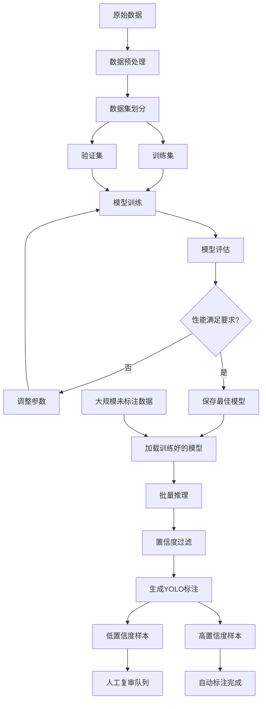

# 图像自动标注系统架构设计

## 1. 系统概述

本系统旨在通过少量标注数据训练YOLO模型，然后使用训练好的模型对大规模数据集进行自动标注，以减轻人工标注工作量。

## 2. 核心功能模块

### 2.1 数据管理模块
- 数据集组织和验证
- 标注格式转换（支持多种格式转YOLO格式）
- 数据增强和预处理
- 训练/验证集划分

### 2.2 模型训练模块
- 支持多种YOLO版本（YOLOv5/v8/v11等）
- 可配置的训练参数
- 训练过程监控和日志记录
- 模型验证和评估
- 最佳模型保存

### 2.3 自动标注模块
- 批量图像推理
- 置信度阈值过滤
- YOLO格式标注文件生成
- 预测结果可视化
- 不确定性样本标记（人工复审）

### 2.4 工具模块
- 配置管理
- 日志系统
- 性能监控
- 结果统计和分析

## 3. 项目目录结构

```
model_train/
├── config/
│   ├── config.yaml              # 主配置文件
│   ├── model_config.yaml        # 模型配置
│   └── dataset_config.yaml      # 数据集配置
├── data/
│   ├── raw/                     # 原始数据
│   │   ├── images/
│   │   └── labels/
│   ├── train/                   # 训练数据
│   │   ├── images/
│   │   └── labels/
│   ├── val/                     # 验证数据
│   │   ├── images/
│   │   └── labels/
│   └── unlabeled/               # 待标注数据
│       └── images/
├── models/
│   ├── pretrained/              # 预训练权重
│   └── trained/                 # 训练后的模型
│       ├── best.pt
│       └── last.pt
├── output/
│   ├── predictions/             # 预测结果
│   │   ├── images/              # 可视化图像
│   │   └── labels/              # 生成的标注
│   ├── logs/                    # 训练日志
│   └── metrics/                 # 评估指标
├── src/
│   ├── __init__.py
│   ├── data_processor.py        # 数据处理
│   ├── trainer.py               # 模型训练
│   ├── predictor.py             # 模型推理
│   ├── auto_annotator.py        # 自动标注
│   ├── visualizer.py            # 可视化工具
│   └── utils.py                 # 工具函数
├── scripts/
│   ├── prepare_data.py          # 数据准备脚本
│   ├── train_model.py           # 训练脚本
│   ├── auto_label.py            # 自动标注脚本
│   └── evaluate.py              # 评估脚本
├── requirements.txt             # 依赖包
├── README.md                    # 项目说明
└── run_pipeline.py              # 完整流程脚本
```

## 4. 技术栈

### 4.1 核心框架
- **深度学习框架**: PyTorch (推荐) / TensorFlow
- **YOLO实现**: Ultralytics (支持YOLOv5/v8/v11)
- **Python版本**: 3.8+

### 4.2 主要依赖库
```
torch >= 2.0.0
torchvision >= 0.15.0
ultralytics >= 8.0.0        # YOLOv8/v11
opencv-python >= 4.8.0
numpy >= 1.24.0
pillow >= 10.0.0
pyyaml >= 6.0
tqdm >= 4.65.0
matplotlib >= 3.7.0
seaborn >= 0.12.0
pandas >= 2.0.0
scikit-learn >= 1.3.0
tensorboard >= 2.13.0       # 可选：训练可视化
```

## 5. 工作流程设计



## 6. 详细工作流程

### 阶段1: 数据准备
1. 组织初始标注数据
2. 验证标注格式
3. 数据增强（可选）
4. 划分训练/验证集（推荐8:2比例）
5. 生成数据集配置文件

### 阶段2: 模型训练
1. 选择预训练模型（COCO/ImageNet等）
2. 配置训练参数（epochs, batch_size, lr等）
3. 启动训练流程
4. 监控训练指标（loss, mAP, precision, recall）
5. 保存最佳模型检查点

### 阶段3: 模型验证
1. 在验证集上评估性能
2. 分析混淆矩阵
3. 检查类别性能差异
4. 可视化预测结果
5. 确认模型可用于自动标注

### 阶段4: 自动标注
1. 加载训练好的模型
2. 批量处理未标注图像
3. 设置置信度阈值（推荐0.5-0.7）
4. 生成YOLO格式标注文件
5. 按置信度分类输出
6. 标记需要人工复审的样本

### 阶段5: 质量控制
1. 统计自动标注覆盖率
2. 分析低置信度样本
3. 人工复审关键样本
4. 迭代优化（可选）

## 7. 配置文件设计

### 7.1 主配置文件 (config.yaml)
```yaml
project:
  name: "auto_annotation_project"
  version: "1.0.0"

paths:
  data_root: "./data"
  model_root: "./models"
  output_root: "./output"

training:
  model_type: "yolov8"        # yolov5, yolov8, yolov11
  model_size: "m"             # n, s, m, l, x
  pretrained: true
  epochs: 100
  batch_size: 16
  img_size: 640
  device: "cuda"              # cuda, cpu, mps
  workers: 8
  patience: 50                # early stopping
  
validation:
  split_ratio: 0.2
  shuffle: true
  random_seed: 42

auto_annotation:
  confidence_threshold: 0.6
  iou_threshold: 0.45
  max_det: 300
  review_threshold: 0.5       # 低于此阈值需人工复审
  batch_size: 32
  save_visualizations: true
  
dataset:
  num_classes: null           # 将从数据中自动检测
  class_names: []             # 将从data.yaml读取
```

## 8. 关键技术决策

### 8.1 模型选择建议
- **小数据集（<500张）**: YOLOv8n 或 YOLOv5s
- **中等数据集（500-2000张）**: YOLOv8s/m
- **大数据集（>2000张）**: YOLOv8m/l 或 YOLOv11

### 8.2 训练策略
- 使用预训练权重（COCO数据集）
- 数据增强：Mosaic, MixUp, HSV调整
- 学习率调度：余弦退火
- Early Stopping: 防止过拟合

### 8.3 自动标注策略
- **高置信度（>0.7）**: 直接使用
- **中等置信度（0.5-0.7）**: 可用但建议抽查
- **低置信度（<0.5）**: 需要人工复审

### 8.4 质量保证
- 计算标注一致性
- 类别分布分析
- 边界框质量检查
- 抽样人工验证

## 9. 性能优化建议

### 9.1 训练优化
- 使用混合精度训练（FP16）
- 梯度累积处理大batch
- 多GPU并行训练
- 缓存数据集到内存

### 9.2 推理优化
- 模型导出为ONNX/TensorRT
- 批量推理
- 多进程处理
- GPU加速

## 10. 扩展功能

### 10.1 主动学习
- 识别模型不确定的样本
- 优先标注高价值样本
- 迭代提升模型性能

### 10.2 模型集成
- 多模型投票
- 提高标注可靠性

### 10.3 半监督学习
- 利用伪标签
- 自训练策略

## 11. 使用示例

### 快速开始
```bash
# 1. 准备数据
python scripts/prepare_data.py --data-dir data/raw --output-dir data

# 2. 训练模型
python scripts/train_model.py --config config/config.yaml

# 3. 自动标注
python scripts/auto_label.py --model models/trained/best.pt --images data/unlabeled/images --output output/predictions

# 4. 评估结果
python scripts/evaluate.py --predictions output/predictions/labels --ground-truth data/val/labels
```

### 完整流程
```bash
# 运行完整pipeline
python run_pipeline.py --config config/config.yaml --mode full
```

## 12. 监控和日志

### 12.1 训练监控
- TensorBoard可视化
- 实时loss曲线
- 验证指标追踪
- 学习率变化

### 12.2 标注监控
- 处理进度条
- 置信度分布统计
- 类别数量统计
- 异常检测

## 13. 注意事项

### 13.1 数据质量
- 确保初始标注准确性
- 类别定义清晰
- 标注一致性检查

### 13.2 模型训练
- 避免过拟合（使用验证集监控）
- 合理设置epoch数
- 关注类别不平衡问题

### 13.3 自动标注
- 不要完全信任自动标注
- 建立人工复审机制
- 记录标注来源（自动/人工）

## 14. 下一步行动

根据此架构设计，实施计划如下：

1. ✅ 完成架构设计
2. 创建项目目录结构
3. 实现数据处理模块
4. 实现训练模块
5. 实现自动标注模块
6. 创建配置文件和脚本
7. 编写文档和使用说明
8. 测试完整工作流

---

**文档版本**: 1.0  
**最后更新**: 2025-12-08  
**作者**: Roo AI Architect